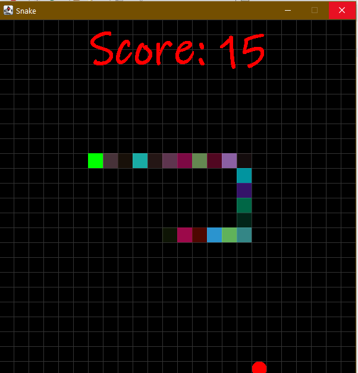
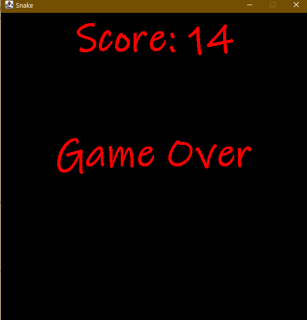

# Snake-Ladder-JAVA
<h3>It's a Simple snake Ladder game Developed using Java in that i've used some of Classes and Interfaces which are:</h3>
<ol>
  <li>JFrame</li>
  <li>JPanel</li>
  <li>AWT Event Handling</li>
</ol>

  
    
  

